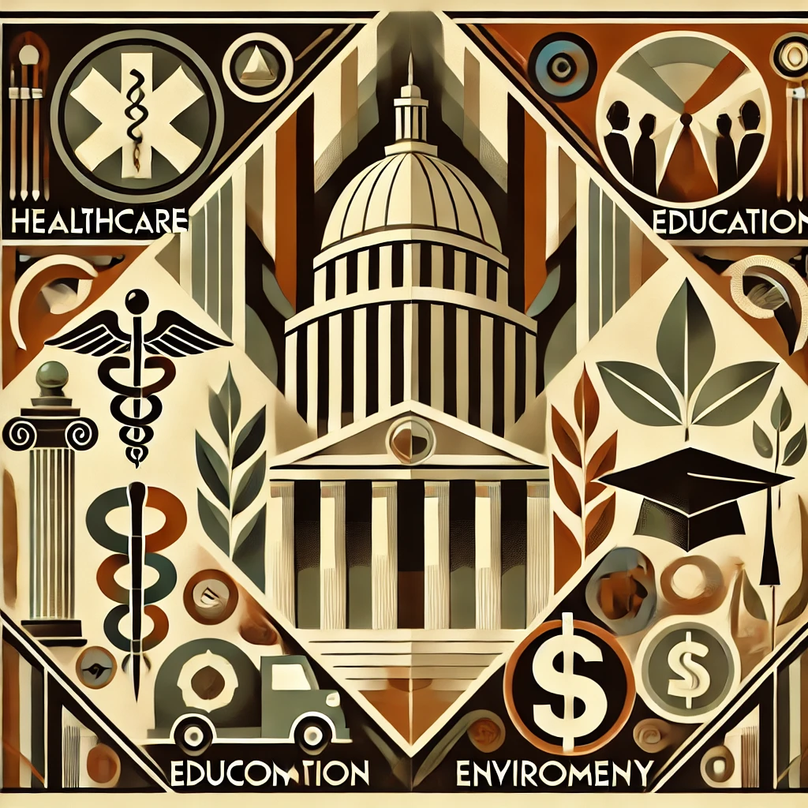
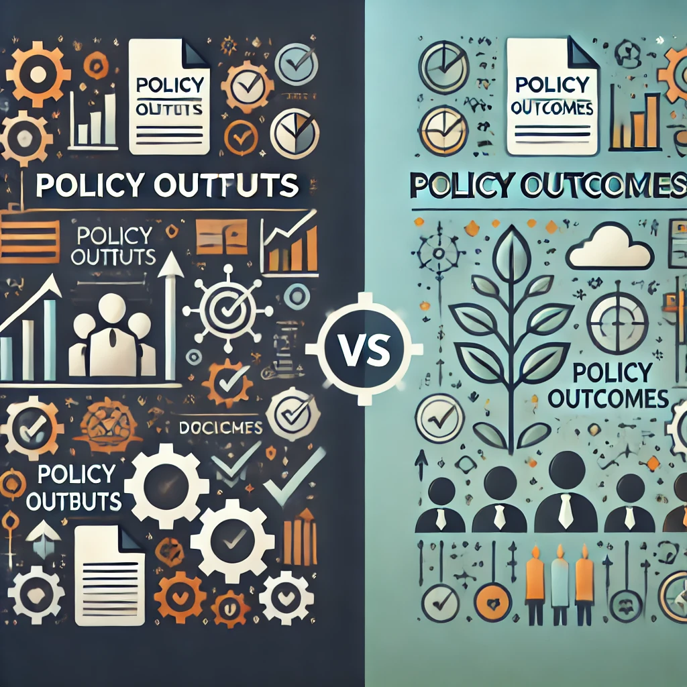
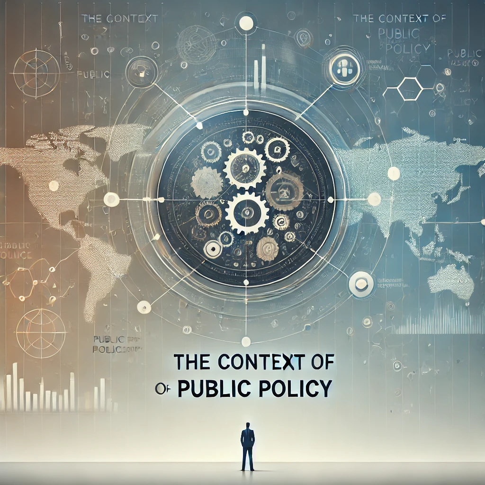

# What is Public Policy?

## POSC 315

### **Week 1**

{width=40%}

---

# What is Public Policy?

**Public Policy** is what officials within government, and by extension the citizens they represent, choose to do or not to do about public problems.

**There's no single definition of public policy.** It's a complex and multifaceted concept that can be understood in many ways.

---

# Defining the Field(s) of Policy Studies

- **Policy studies** is an interdisciplinary field that examines both the content and process of public policies.
- Smith and Larimer emphasize that it encompasses multiple subfields:
  - **Policy Analysis:** Evaluates policy outcomes and alternatives.
  - **Policy Process:** Studies how policies are formulated and implemented.
  - **Policy Advocacy and Governance:** Examines the influence of interest groups and governance structures.
- These subfields are interconnected, reflecting the complexity of real-world policy challenges.

---

# Many different ways to discuss public policy

1. **Intentions**: the purposes of government action
2. **Goals**: the stated ends to be achieved
3. **Plans or proposals**: the means to achieve the goals
4. **Programs**: the authorized means for pursuing the goals
5. **Decisions or choices**: specific actions that are taken to set goals, develop plans, and implement programs

---

# Policy Outputs and Outcomes

1. **Policy Outputs**: the formal actions that governments take to pursue their goals
2. **Policy Outcomes**: the effects that result from policy outputs

{width=30%}

---

# The Basics

- **Institutions**: the rules, norms, and procedures that structure the behavior of individuals and organizations.
- **Government**: the institutions and political processes through which public policy choices are made with legal authority to govern or rule a group of people.
- **Government Institutions**: the US Constitution, Congress, the President, the Courts, the bureaucracy, and state and local governments.
- **Federalism**: the division of power between the national government and state governments; the division of power and authority on a geographic basis.

---

# The Basics (cont.)

- **Politics**: the process of making and implementing decisions that apply to members of a group; concerns the exercise of power and the resolution of conflicts.
- **Policy Making**: the process by which authorities decide which actions to take to address a problem or set of problems.
- **Policy Analysis**: the process of identifying and evaluating policy options and their consequences.

---

# **The Context of Public Policy**

{width=50%}

---

# The Context of Public Policy

## The Social Context

- **Social Problems**: conditions that are harmful to individuals or society and that require collective action to address.
- **Social Values**: the beliefs that people hold about what is good, right, and desirable.
- **Social Norms**: the unwritten rules that guide behavior in a society.
- **Social Changes**: the transformations in society that affect the way people live and work.

---

# The Context of Public Policy (cont.)

## The Economic Context

- **Economic Problems**: conditions that are harmful to individuals or society and that require collective action to address.
- **Economic Policy**: the actions that governments take to influence the economy, such as setting tax rates, spending money, and regulating businesses.

---

# The Context of Public Policy (cont.)

## The Political Context

- **Political Problems**: conditions that are harmful to individuals or society and that require collective action to address.
- **Political Party System**: the organization of political parties and the competition between them.
- **Trust in Government**: the belief that government will act in the public interest.
- **Ideology**: a set of beliefs about the proper role of government in society.

---

# The Context of Public Policy (cont.)

## The Governing Context

- **Complex Governance Structures**: the overlapping and interdependent relationships among government agencies, interest groups, and other organizations.
- **Shared Responsibility**: the idea that government, the private sector, and civil society all have a role to play in addressing public problems.

--- 

# The Context of Public Policy (cont.)

## The Cultural Context

- **Political Culture**: refers to widely held values, beliefs, and attitudes, such as trust and confidence in government and the political process, or the lack thereof.
- **Political Socialization**: the process by which individuals learn about politics and acquire political values and beliefs.
- **Political Participation**: the ways in which people get involved in politics, such as voting, running for office, or joining interest groups.
- **Cultural Differences**: help to explain the wide variation in state and local public policies.

---

# **Reasons for Government Inolvement**

{width=50%}

---

# Reasons for Government Inolvement

1. **Political**: shifts in public opinion; rise of social movements
2. **Moral or Ethical**: action is the "right" thing to do, even without public support
3. **Economic**: market failures; externalities; public goods

---

# Reasons for Government Inolvement (cont.)

## Economics and Market Failure 

1. **Market Systems and Government Intervention**
   - In a pure capitalist or market system, government intervention is often seen as a distortion of market efficiency.
   - **Market Failure:** Occurs when the private market is not efficient, justifying government intervention.
  
---

# Reasons for Government Inolvement (cont.)

## Economics and Market Failure 

1. **Market Systems and Government Intervention**
   - In a pure capitalist or market system, government intervention is often seen as a distortion of market efficiency.
   - **Market Failure:** Occurs when the private market is not efficient, justifying government intervention.
  
2. **Types of Market Failures**
   - **Monopolies & Oligopolies:** Occur when one or a few companies dominate the market, controlling prices.
   - **Externalities:** 
     - *Negative Externality:* Harm caused to a third party without compensation.
     - *Positive Externality:* Benefit gained by a third party without payment.
  
---

# Reasons for Government Inolvement (cont.)

##  **Other Types of Market Failures**

1. **Information Failure**
   - Occurs when crucial information for buyers and sellers is incomplete or not easily accessible.

2. **Inability to Provide Public/Collective Goods**
   - **Public/Collective Goods:** Defined by two criteria:
     - *Exclusion:* Ability to exclude someone from accessing the good.
     - *Joint Consumption:* Ability for multiple people to consume the good simultaneously.

---

# Reasons for Government Inolvement (cont.)

##  **Other Types of Market Failures**

1. **Information Failure**
   - Occurs when crucial information for buyers and sellers is incomplete or not easily accessible.

2. **Inability to Provide Public/Collective Goods**
   - **Public/Collective Goods:** Defined by two criteria:
     - *Exclusion:* Ability to exclude someone from accessing the good.
     - *Joint Consumption:* Ability for multiple people to consume the good simultaneously.

---

# Reasons for Government Inolvement (cont.)

## Examples of Public Goods

{width=100%}

---

# **The Practice of Policy Analysis**

{width=50%}

---

# **The Practice of Policy Analysis**

- **Everyday Relevance:**
  - Policy analysis isn't just for specialists; we all use it in daily decisions (e.g., buying a car, choosing a course).

---

# **The Practice of Policy Analysis**

- **Everyday Relevance:**
  - Policy analysis isn't just for specialists; we all use it in daily decisions (e.g., buying a car, choosing a course).

- **Uses of Policy Analysis:**
  - Formulating policies and evaluating programs.
  - Describing the scope of public problems.
  - Assessing the feasibility of policy choices.
  - Evaluating program effectiveness.
  - Providing a counterweight to partisan or ideological decision-making.

---

# **The Practice of Policy Analysis**

- **Everyday Relevance:**
  - Policy analysis isn't just for specialists; we all use it in daily decisions (e.g., buying a car, choosing a course).

- **Uses of Policy Analysis:**
  - Formulating policies and evaluating programs.
  - Describing the scope of public problems.
  - Assessing the feasibility of policy choices.
  - Evaluating program effectiveness.
  - Providing a counterweight to partisan or ideological decision-making.

- **Citizens and Policy Analysis:**
  - Helps citizens and interest groups make informed decisions and arguments.
  - Important for students to evaluate information critically.

---

# **Deciding the Best Policy: Using Multiple Criteria**
- **Key Criteria:**
  - **Effectiveness:** Will the policy work?
  - **Efficiency:** What are the costs vs. benefits?
  - **Equity:** Is the policy fair?
  - **Political Feasibility:** Is the policy acceptable to officials and actors?

- **Flexibility:** 
  - These criteria are not exhaustive—others may be relevant based on the specific issue.

---

# **That's all for today!**

1. Discussion 1 Post due on Tuesday
2. Read Kraft & Furlong, Ch. 2 and Smith & Larimer, Ch. 3 for Next Week
3. Sign up for Kritik
4. Have a great long weekend!

